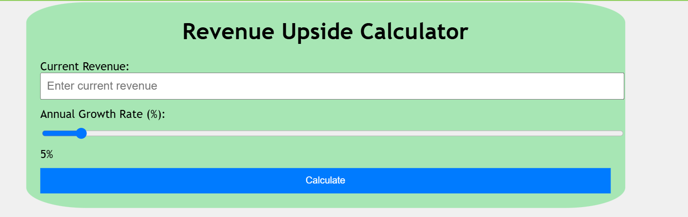
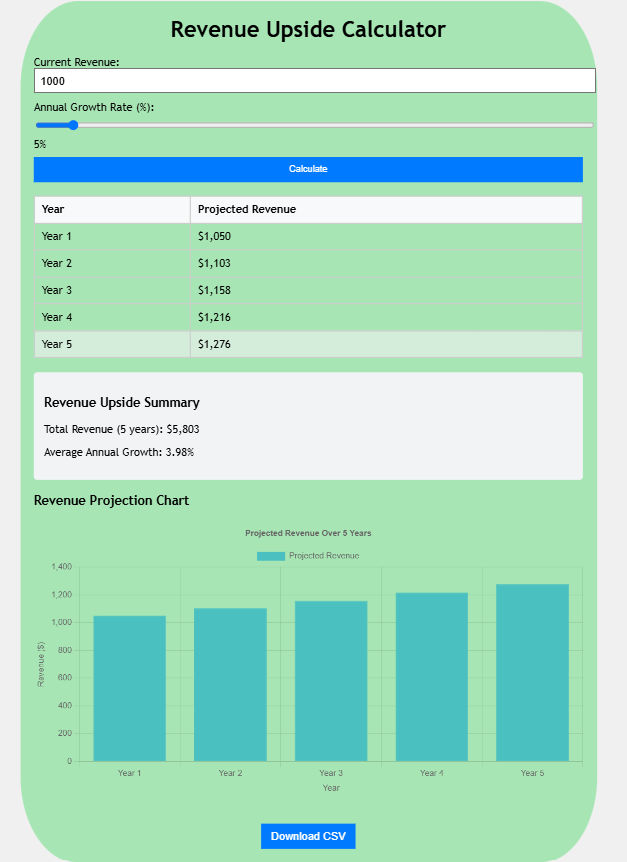
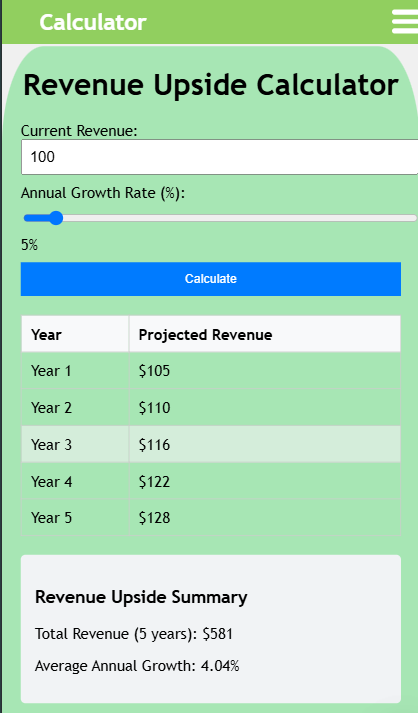

# Revenue Calculator
A web application that having revenue upside calculator feature for a stock analyzer application. The calculator will allow users to input revenue growth assumptions and calculate projected revenue for the next 5 years


## Table of Contents
- [Features](#features)
- [Installation](#installation)
- [Usage](#usage)
- [Bonus Challenges](#bonus-Challenges)
- [Screenshots](#screenshots)
- [Technologies Used](#technologies-used)
- [Contributing](#contributing)


## Features
- **User Input Form**:
  -  A field to input the current revenue & annual growth rate.
  -  A button to calculate the projected revenue.  
- **Projected Revenue Output**
  -  A table or list displaying the projected revenue for each of the next 5 years.
  -  Highlight the year with the highest growth in revenue compared to the previous year.
- **Revenue Upside Summary**:
  -  Display the total revenue over the 5 years.
  -  Show the average annual growth in percentage.
- **Responsive Design**:
  -   Ensurethe layout works seamlessly on desktop and mobile devices.
- **Validation**:
  -   Ensureinputs are validated (e.g., positive numbers for revenue and growth rate).
- **Dynamic Calculatio**:
  -  Perform calculations dynamically when the user clicks the "Calculate" button.


## Installation
1. Clone the repository:
   ```bash
   git clone https://github.com/username/repository-name.git
2. cd repository-name
3. npm install
4. npm install -D tailwindcss >> npx tailwindcss init
5. npm install chart.js react-chartjs-2 
6. npm start


## Usage
- Open the app in your browser at `http://localhost:3000/`.
- Enter current revenue
- Select annual growth rate from the slider.
- Cick on genrate to calculate the Projected Revenue for next five years
- View the generated bar graph on it.
- You can also download the csv file from the button given below.


## Bonus Challenges
- **InputSilder**:
  -  For growth rate to improve user experience.
- **Visualizations**:
  -  Bar chart for projected revenue using chart.js
- **Downloader**:
  -  Allow the user to download the projections as a CSV file.  


## Screenshots





## Technologies Used
- React
- Html, CSS, Javascript
- Chartjs
- Github pages (for deployment)


## Contributing
Contributions are welcome!  
- Fork the repo.
- Create a new branch for your feature/bugfix.
- Commit and push your changes.
